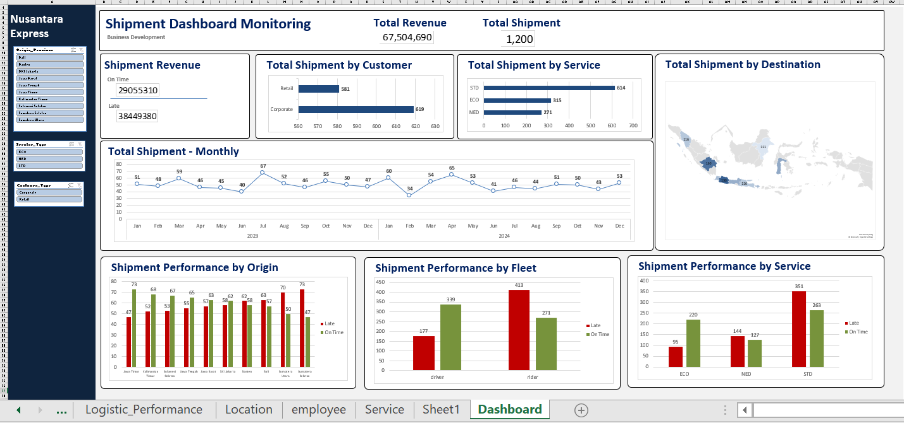

# 📦 Dashboard Monitoring Kinerja Pengiriman Logistik
End-to-End Data Analysis & Visualization Project

## 📌 Project Overview
Project ini bertujuan untuk menganalisis kinerja operasional logistik, dengan fokus pada pemantauan pendapatan, ketepatan waktu pengiriman, dan perilaku pelanggan. Analisis dilakukan untuk mendukung pengambilan keputusan berbasis data guna meningkatkan efisiensi, mengurangi biaya keterlambatan, dan mengoptimalkan layanan.

Hasil analisis divisualisasikan dalam dashboard interaktif untuk memudahkan eksplorasi tren, kontribusi segmen, dan identifikasi area yang memerlukan perbaikan.

### Key Highlight
*   Total pendapatan dari pengiriman mencapai **Rp 67,504,690** dengan total **1,200** pengiriman.
*   **Temuan krusial:** Pendapatan dari pengiriman terlambat (`Late`) lebih tinggi daripada pengiriman tepat waktu (`On Time`).
*   Segmen pelanggan `Corporate` dan `Retail` memberikan kontribusi jumlah pengiriman yang hampir seimbang.
*   Layanan `STD` (Standard) menjadi pilihan paling populer di antara pelanggan.

---

## 🗂️ Repository Structure
```
├── shipment_data.csv              # Dataset pengiriman
├── shipment_analysis.ipynb        # Analisis data dengan Python (Pandas, Matplotlib)
├── shipment_dashboard.twbx        # Dashboard interaktif Tableau
├── assets/
│   └── shipment_dashboard.png     # Preview tampilan dashboard
└── README.md
```

---

## 📊 Dashboard Preview


Dashboard menampilkan:
*   Total Pendapatan & Jumlah Pengiriman
*   Perbandingan Pendapatan (`On Time` vs. `Late`)
*   Distribusi Pengiriman berdasarkan Pelanggan (`Retail` vs. `Corporate`)
*   Distribusi Pengiriman berdasarkan Jenis Layanan (`STD`, `ECO`, `NED`)
*   Tren pengiriman bulanan
*   Grafik performa multi-dimensi
*   Filter interaktif untuk analisis mendalam

---

## 🎯 Business Problem
Tim operasional dan manajemen logistik sering kali menghadapi tantangan dalam:
*   Mendapatkan gambaran menyeluruh tentang kinerja pengiriman secara real-time.
*   Mengidentifikasi akar penyebab keterlambatan dan dampak finansialnya.
*   Memahami preferensi pelanggan dan efektivitas setiap layanan yang ditawarkan.
*   Membuat keputusan cepat tanpa didukung oleh data yang terintegrasi.

---

## 🎯 Objectives
*   Mengukur total pendapatan dan volume pengiriman.
*   Menganalisis dampak finansial dari ketepatan waktu pengiriman.
*   Mengidentifikasi segmen pelanggan dan jenis layanan yang paling berkontribusi.
*   Memantau tren kinerja pengiriman dari waktu ke waktu untuk mengidentifikasi pola musiman atau penurunan performa.
*   Menyediakan dashboard interaktif yang mudah diakses oleh stakeholder non-teknis untuk mendukung keputusan operasional.

---

## 🛠️ Tech Stack & Workflow
### 1️⃣ Data Processing & Analysis (Python)
*   **Tools**: Python (Pandas, NumPy, Matplotlib)
*   **Proses**:
    *   Pembersihan dan persiapan data.
    *   Agregasi data untuk menghitung KPI utama (total pendapatan, rata-rata, kontribusi segmen).
    *   Analisis awal untuk mengidentifikasi pola dan outlier.

### 2️⃣ Exploratory Data Analysis
*   Analisis perbandingan pendapatan antara pengiriman tepat waktu dan terlambat.
*   Investigasi hubungan antara segmen pelanggan, jenis layanan, dan ketepatan waktu.
*   Identifikasi tren bulanan untuk perencanaan kapasitas.

### 3️⃣ Data Visualization (Tableau)
*   Dashboard interaktif dibangun untuk menampilkan:
    *   KPI utama (Total Revenue, Total Shipments).
    *   Grafik batang dan pie untuk distribusi segmen dan layanan.
    *   Grafik garis untuk tren waktu.
    *   Filter dinamis berdasarkan periode waktu, wilayah, atau kategori lainnya.

---

## 🔍 Key Insights & Findings
### 1️⃣ Dampak Keuangan dari Keterlambatan
Pendapatan dari pengiriman yang **terlambat (`Late: Rp 38,449,380`)** secara signifikan lebih tinggi daripada pengiriman yang **tepat waktu (`On Time: Rp 29,055,310`)**. Ini adalah sinyal kritis yang bisa disebabkan oleh:
*   Adanya biaya penalti atau kompensasi keterlambatan.
*   Pengiriman bernilai tinggi (mungkin dari segmen `Corporate`) cenderung mengalami delay.
*   Area ini perlu diselidiki lebih lanjut untuk mengurangi kerugian dan meningkatkan kepuasan pelanggan.

### 2️⃣ Segmen Pelanggan yang Seimbang
Jumlah pengiriman untuk segmen **`Corporate` (619)** dan **`Retail` (581)** relatif setara. Ini menunjukkan bahwa strategi operasional dan pemasaran harus mempertimbangkan kedua segmen secara adil, namun dengan pendekatan yang mungkin berbeda.

### 3️⃣ Preferensi Layanan
Layanan **`STD` (Standard)** menjadi yang paling banyak digunakan (614 pengiriman), diikuti oleh **`ECO` (Economy)** dan **`NED` (Next-day/Express)**. Pemahaman ini dapat membantu tim operasional dalam:
*   Mengalokasikan sumber daya (kendaraan, tenaga kerja) secara proporsional.
*   Membuat strategi promosi untuk layanan yang kurang populer.

---

## 📌 Conclusion
Dashboard ini memberikan visibilitas end-to-end terhadap kinerja logistik. Dengan memvisualisasikan data kompleks menjadi wawasan yang dapat ditindaklanjuti, stakeholder dapat:
*   **Mengidentifikasi area masalah** secara cepat, seperti tingginya biaya keterlambatan.
*   **Mengoptimalkan operasional** berdasarkan preferensi pelanggan dan popularitas layanan.
*   **Membuat keputusan strategis** yang didukung oleh data tren historis.
*   Pada akhirnya, alat ini diharapkan dapat meningkatkan efisiensi, mengurangi biaya, dan meningkatkan kepuasan pelanggan.

## 👤 Author
**[Asri Sabilla Putri]** 📊 Data Analyst
🔗 LinkedIn: [[Link LinkedIn Anda](https://www.linkedin.com/in/asrisabilla)]
🌐 Portfolio: [[Link Portfolio Anda](https://portofolio-asri.netlify.app/)]
